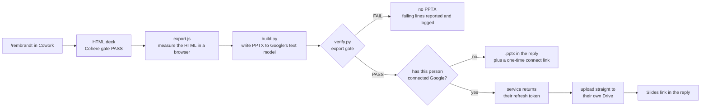

# Rembrandt 2.0 rollout: from this branch to a Google Slides link on every run

Rembrandt 1.0 turns any material into an Axoniq deck as one HTML file. Rembrandt 2.0 adds a
Google Slides file to every run, for the people who present and edit in Slides. The deck lands in
the runner's own Google Drive, owned by them, in a folder called `Rembrandt decks`. Each person
connects their Google account once, ever, and nothing is installed on anyone's machine.

The cost is two one-time requests to one admin, described below, and the code in this branch,
which is what the admin is asked to review.

This document is the whole plan, in order. Owner is in brackets.

## How a run ends up in Google Slides

Everything except the token lookup runs inside the Cowork sandbox, on the runner's own session,
with nothing installed beyond what the kit carries. The deck itself never passes through our
service: it goes from the sandbox to Google. That is why there is no file size ceiling and no
server timeout to design around.

## Why the Google Drive connector is not the pipe

The connector takes the file as base64 inside the tool call, so the model has to reproduce every
byte of the deck through its own output. A 9 KB probe survived that; a 39 KB test deck did not, one
wrong character and a corrupted zip; a real deck with screenshots is megabytes. No prompt fixes
this. The upload has to be made by code, which is what `kit/export/gdrive.js` does.

## Why we need the two admin actions

**Anthropic network allowlist (org owner, claude.ai, Admin settings, Capabilities).** The Cowork
sandbox can reach package registries and nothing else. Every other host is refused by the sandbox
proxy before the request leaves; checked on 22 September 2026, all three below answer `403
Forbidden` at `CONNECT`. Three entries:

| host | why |
| --- | --- |
| `rembrandt-telemetry.vercel.app` | our own service: the usage log and the token store |
| `www.googleapis.com` | Drive itself, where the deck is uploaded |
| `oauth2.googleapis.com` | exchanging and refreshing the person's token |

`accounts.google.com` is deliberately absent. The consent page opens in the person's own browser,
never in the sandbox.

**A Google Cloud project with one OAuth client (Workspace or Cloud admin).** A project with the
Drive API enabled, and one OAuth client of the installed-app type, with the consent screen set to
internal so only `axoniq.io` accounts can use it. That is all. There is no service account, no
domain-wide delegation, and no shared mailbox: each person authorises their own account, and the
scope is `drive.file`, which lets Rembrandt create files and manage the files it created and read
nothing else in anyone's Drive. Anyone can revoke it at https://myaccount.google.com/permissions,
or with `node kit/export/authorize.js --forget`.

## What telemetry sends, and why

Telemetry exists so we can see whether Rembrandt is used and whether it is working, without asking
anyone. It is code in the gate, not a prose instruction, so it fires the same way on every run. It
never changes the outcome of a run: a collector that is down costs a run nothing but a `not
recorded` line.

Two logs, both markdown tables behind a token in Vercel Blob.

| log | when a row is written | what the row holds |
| --- | --- | --- |
| decks | once per deck that passed Cohere and was delivered | when, runner's email, deck name, Rembrandt version, slide count, chapter count, dense-slide count |
| exports | once per PPTX export attempt | when, runner's email, deck name, version, outcome (`slides`, `file`, or `gate-failed`), number of gate failures, and the failing lines |

The failing lines are the new part and the reason the exports log exists. When the export gate
rejects a PPTX, the row carries `verify.py`'s output for each failure: the slide, which check failed
(TEXT, FIT, GEOM or HOUSE), and up to 44 characters of the text on that line. That is enough to
reproduce the defect and fix the exporter without ever asking the runner for their deck. It is also
the only place telemetry holds words from a slide, so: it is sent only on a gate failure, only for
the lines that failed, capped at 40 lines, and a passing run sends no text at all. The runner's
email comes from the signed-in Claude account, first-hand, not inferred. `REMBRANDT_TELEMETRY=0`
turns all of it off.

The same service also holds one Google refresh token per person, encrypted with AES-256-GCM under a
key that never leaves the server. It is there only because the Cowork sandbox is wiped when a
session ends, so there is nowhere else to keep it. `telemetry/README.md` states the trust boundary
plainly: the route believes the caller about who it is, which is bounded by the `drive.file` scope
and is fine for an internal trial and not for anything wider.

Because these hold work email addresses, they are personal data. The blob paths are unguessable and
the read endpoint is token-gated. If this grows past internal usage counting, it wants a retention
rule and a line in the internal privacy notice.

## What the admin is reviewing

| path | what it is | why it matters for review |
| --- | --- | --- |
| `skills/rembrandt/kit/export/gdrive.js` | everything that talks to Google | the scope asked for, and what is uploaded where |
| `skills/rembrandt/kit/export/authorize.js` | the one-time connect | what a person is agreeing to |
| `skills/rembrandt/kit/export/export.js` | the exporter's orchestrator | what leaves the sandbox, and when it falls back |
| `skills/rembrandt/kit/export/` (rest) | `extract.js`, `build.py`, `minipptx.py`, `shape.py`, `verify.py`, the two test files, vendored fonts | the deck itself: measured, built, and proven before anything is delivered |
| `skills/rembrandt/kit/telemetry.js` | the telemetry client | what is reported and when |
| `skills/rembrandt/kit/service.json` | host and OAuth client, shipped with the kit | the hosts to allowlist |
| `telemetry/api/token.js` | the token store | how tokens are encrypted, and who can ask for one |
| `telemetry/api/collect.js`, `telemetry/api/log.js` | the collector and the token-gated reader | what is stored and who can read it |
| `telemetry/README.md` | environment, deploy, and the four things worth knowing | operational truth |
| `skills/rembrandt/SKILL.md`, **Export** section | what the model is told to do | the human-readable contract |

No dependency is fetched at run time except three Python wheels from PyPI (`uharfbuzz`, `fonttools`,
`brotli`), which the sandbox already allows. Playwright and Chromium are preinstalled in Cowork.

## The steps

**A. Code review and merge** [Ayadi]

1. Push this branch to `github.com/AxonIQ/rembrandt` and open a pull request against `main`.
2. Share the PR with the admin as the thing to review. This file is at the root of the branch.
3. Merge when reviewed. Do not tag a release yet; the OAuth client has to exist first.

**B. Anthropic allowlist** [Axoniq org owner in claude.ai]

4. Admin settings, Capabilities, add the three hosts in the table above.
5. Worth doing first: put `rembrandt.axoniq.io` in front of the Vercel project as a CNAME and
   allowlist that instead of the `vercel.app` host. An admin can judge an Axoniq host on sight, and
   the entry then survives a project rename.
6. Until this is done, every run reports `not recorded` and delivers the PPTX as a file. That is the
   designed fallback, not a failure, and it is why the code can ship before the allowlist lands.

**C. The Google OAuth client** [Cloud or Workspace admin, then Ayadi]

7. A Google Cloud project, say `rembrandt`, with the Drive API enabled.
8. OAuth consent screen: internal. Scope: `https://www.googleapis.com/auth/drive.file`, nothing else.
9. One OAuth client, type Desktop app. Hand the client id and secret to Ayadi.
10. Ayadi puts both into `skills/rembrandt/kit/service.json` and commits. They ship with the kit on
    purpose: the exchange happens in each person's own sandbox, and an installed-app client's
    secret is not confidential by design.

**D. Deploy the service** [Ayadi]

The project stays on the personal Hobby account for the trial. Hobby is non-commercial personal use
only, so before this stops being a trial it moves to an Axoniq Pro team or onto Axoniq's own
infrastructure. Cost is not the reason to move: a run costs two function invocations and about a
kilobyte, so it stays inside the free allowances at any volume Axoniq will reach.

11. In `telemetry/`: add `TOKEN_SECRET` alongside the existing variables (see `telemetry/README.md`),
    then `npx vercel deploy --prod`.
12. Prove it from outside the sandbox: `curl -s "https://rembrandt-telemetry.vercel.app/api/token?email=ayadi@axoniq.io"`
    answers `404` with `no token stored for that address`, which means the route is alive.

**E. Connect one account and prove the round trip** [Ayadi, with Claude]

13. `node kit/export/authorize.js`, open the link, approve, paste the code back. Once.
14. Run `/rembrandt` and confirm the reply carries a Slides link, and that the deck is in your own
    Drive under `Rembrandt decks`, owned by you.
15. Prove the fidelity model against real Google once: open that deck in Slides, export a PDF, run
    `python3 kit/export/measure.py scene.json export.pdf`. Every text block should land within 1 px
    of the browser. This is the check that Google still behaves as measured; the export gate does
    not need it per run.
16. Fix anything it shows; re-run `test_export.py` and `test_delivery.py`.

**F. Release** [Ayadi]

17. Bump `skills/rembrandt/kit/VERSION` and `.claude-plugin/plugin.json` to `2.0.0`. Move the
    CHANGELOG's Unreleased entry under 2.0.0 with the date.
18. Tag `v2.0.0`, push the tag. Cowork installs with Sync on pick it up on their own.
19. One message to the people who use Rembrandt: every deck now comes with a Google Slides link in
    their own Drive; the first run asks them to connect Google once; the deck is 26.67 by 15 in, so
    slides pasted into a 10 in deck are rescaled; the HTML remains the source and the thing Cohere
    checks.

## What a run looks like afterwards

The person types `/rembrandt`, answers the questionnaire, and at the end receives the HTML artifact,
a Google Slides link in their own Drive, and the change report. The very first time, they get the
`.pptx` and a link to connect Google, and every run after that is automatic. If the service or
Google is unreachable that day, they get the `.pptx` and one line telling them to drop it into
Drive.

## Known limits, on purpose

- Google Slides drops letter spacing, so text set in Inter ships as Inter Tight; 470 to 540 ship as
  Medium, 550 and 560 as SemiBold. The study doc has the measurements.
- The canvas is 26.67 by 15 in so that every size is a whole point. Slides pasted into a 10 in deck
  are rescaled by Slides.
- Gradients, dot patterns and icons are 2x rasters in the PPTX; they look right and are not editable.
- The export runs after Cohere and adds about 40 seconds for a 37-slide deck; the upload adds a few
  seconds more.
- Connecting Google means copying a code out of a browser address bar, because the sandbox has no
  browser for Google to redirect back into. It is once per person.
- The token store believes the caller about who it is. `telemetry/README.md` says what bounds that
  and what would have to change before Rembrandt went past Axoniq.
